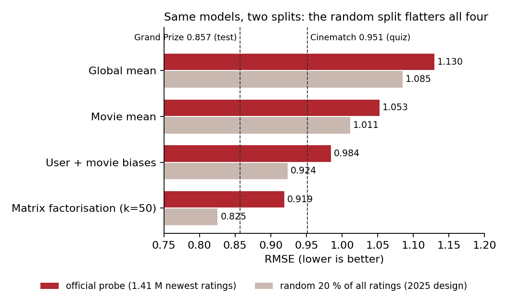

# Netflix Prize: how good was "0.81 RMSE" really?

**Live page:** [setosfk.github.io/projects/netflix-prize](https://setosfk.github.io/projects/netflix-prize/) · Python + R · 2026 re-analysis in [`reanalysis/`](reanalysis/) · [Türkçe özet ↓](#türkçe-özet)

Our 2025 team project reported **0.81 RMSE** on the Netflix Prize data (100,480,507 ratings, 480,189 users,
17,770 films). That number came from a random 80/20 split of all ratings. The Prize itself scored models on each
user's *newest* ratings (the probe / quiz / test sets). In 2026 I re-ran the same kinds of model on both designs,
side by side, in Python and R.

## Results (RMSE, lower is better)

| Model | Official probe (1,408,395 newest ratings) | Random 20 % of all ratings (2025 design) |
|---|---|---|
| Global mean | 1.1296 | 1.0853 |
| Movie mean | 1.0528 *(published quiz benchmark: 1.0540)* | 1.0114 |
| User + movie biases (shrunken) | 0.9843 | 0.9237 |
| **Matrix factorisation** (biased SGD, k = 50, 20 epochs) | **0.9187** | **0.8254** |
| *Cinematch, Netflix's own system* | *0.9514 (quiz)* | — |
| *Grand Prize winner (2009)* | *0.8567 (test)* | — |



**The split, not the model, explains most of "0.81".** Every model looks 0.04–0.09 RMSE better on the random
split. On the probe the same factorisation scores 0.919: better than Cinematch, far from the prize. Why the
random split is easier:

- in the random split almost every test rating (99.7 %) falls on or before the user's last training date — the model has already seen the user's later behaviour; on the probe only 37 % do (same-day ratings);
- random-split test ratings come from heavy users (median 369 training ratings vs 98 on the probe; 6 % vs 33 % from users with ≤ 50 ratings), and light users are the hard ones (probe RMSE 1.065 for users with ≤ 10 training ratings vs 0.792 for > 1,000).

Also found: the monthly mean rating jumps from 3.42 (Dec 2003) to 3.58 (Jun 2004) and keeps rising — a known
break in this data that a time-blind model carries as error. Data checks: 0 duplicate user–film pairs; all
1,408,395 probe pairs found in the training files.

**Similar films.** The live page and both apps list, for 7,058 films with ≥ 1,000 training ratings, the ten
nearest films by the learned factor vectors (e.g. *The Fellowship of the Ring* → the other *Lord of the Rings*
films, then *The Empire Strikes Back*).

## Run it

```bash
# data: Kaggle netflix-inc/netflix-prize-data → data/raw/ (combined_data_1-4.txt, probe.txt, movie_titles.csv)
pip install -r reanalysis/requirements.txt
python reanalysis/python/prepare.py         # ~2 min: parse 100 M ratings, build both splits (data/work/, ~4 GB)
python reanalysis/python/run_analysis.py    # ~20 min: baselines + 2 × 20 epochs of SGD
python reanalysis/python/build_web.py       # page data + figures
Rscript reanalysis/R/run_analysis.R         # R twin (Rcpp), ~25 min
streamlit run reanalysis/python/app.py      # Python app
Rscript -e 'shiny::runApp("reanalysis/R")'  # R app
python -m http.server -d reanalysis/web     # static page
```

**Python ↔ R parity:** both languages train on the same split files, in the same order, from the same starting
factors; all eight RMSEs agree to 5 decimals (e.g. probe factorisation 0.91871 in both).

## Read with care

- Hyperparameters are textbook defaults (k = 50, learning rate 0.005, regularisation 0.02, 20 epochs), never tuned on the probe. Tuning would lower both columns; the gap points the same way for all four models.
- The probe is not the quiz/test set; Cinematch and the prize are quoted on quiz/test. Directional, not exact.
- Similar films come from rating patterns, not content.

**Data licence.** The Netflix Prize data may be used for research only: no redistribution, no commercial use, use
must be acknowledged. The re-analysis publishes aggregates and film similarities only — no rating, user or date.
Not affiliated with or endorsed by Netflix. Re-analysis code (`reanalysis/`): MIT.

---

## Türkçe özet

**Soru:** 2025'teki takım projemizin 0,81 RMSE'si gerçekte ne kadar iyiydi?

- 0,81 tüm puanların rastgele %20'sinde ölçülmüştü. Aynı tür model resmî probe kümesinde (her kullanıcının en yeni puanları) **0,919**: Cinematch'ten (0,9514) iyi, büyük ödülden (0,8567) uzak.
- Rastgele bölme dört modelin dördünü de 0,04–0,09 daha iyi gösteriyor; farkı model değil bölme yöntemi yaratıyor. Rastgele bölmede test puanlarının neredeyse tamamı kullanıcının son eğitim tarihinde ya da öncesinde; test kullanıcıları da çok daha yoğun.
- Veride 2004 başında ortalama puanda kırılma var (3,42 → 3,58). Python ve R aynı sekiz RMSE'yi 5 ondalığa kadar veriyor.
- Canlı sayfada 7.058 film için "benzer filmler" gezgini var. Veri lisansı yalnız araştırma amaçlı; ham veri yayımlanmıyor.

---

## Original team project (2025)

*Yunus Emre Civelek, Mxlenos and Sertan Şafak. Everything below is the 2025 README, unchanged apart from the clone URL.*

## Content

- [Introduction](#introduction)
- [Repository Structure](#repository-structure)
- [Requirements](#requirements)
- [Installation & Setup](#installation--setup)
- [Usage](#usage)

---

## Introduction

This project comprises comprehensive analytical studies conducted using the Netflix Prize dataset obtained from Kaggle. The project employs both Python and R languages to perform data processing, modeling, and analysis tasks. The objective is to develop applications in this field by experimenting with recommendation systems and other analytical methods on large datasets.

---

## Repository Structure

```bash
.
├── data          # Contains processed datasets used in the models.
├── data_merging  # Hosts Python modules that merge and prepare data.
├── models        # Directory for different model examples (Python and R).
├── src           # Folder containing files where the main model is implemented.
├── tests         # Directory for test and exploratory scripts.
├── datasets      # Stores raw data files.
└── dist          # Contains prepared data files for analysis.
```

---

## Requirements

- Python 3.8
- Conda (for environment management)
- Jupyter Notebook (for Python-based analysis)
- R (version 4.0 or newer)
- RStudio (for R-based analysis)

---

## Installation & Setup

### 1. Clone the Repository

- Run the following commands in your terminal:

  ```bash
  git clone https://github.com/SETOsfk/netflix-prize-data-analysis.git
  cd netflix-prize-data-analysis
  ```

### 2. Prepare the Dataset

- Create a `datasets/` directory and set permissions:

  ```bash
  mkdir datasets
  sudo chown $USER:$USER datasets # Adjust ownership (if needed)
  chmod 755 datasets
  ```

- Download the [Netflix Prize Dataset](https://www.kaggle.com/datasets/netflix-inc/netflix-prize-data) as `archive.zip` and move it to the `datasets/` folder.

### 3. Set Up Python Environment

- Create a Conda environment and install dependencies:

  ```bash
  conda create -n netflix-prize-data python=3.8
  conda activate netflix-prize-data
  pip install -r requirements.txt
  pip install ipykernel
  python -m ipykernel install --user --name netflix-prize-data --display-name "Python (netflix-prize-data)"
  ```

---

## Usage

### 1. Preprocess Data

- Run the preprocessing script to generate analysis-ready data:

  ```bash
  python dm.py # Ensure the Conda environment is active
  ```

  This generates processed files in the `dist/` directory.

### 2. Exploratory Data Analysis (EDA)

  - Open `tests/eda.R` in **RStudio** and execute it to perform EDA.

### 3. Run Models

#### Python Models (Jupyter Notebooks)

- Launch Jupyter Notebook:
  ```bash
  jupyter notebook
  ```

- Open notebooks in `models/`:
  - ``neucf.ipynb:`` Neural Collaborative Filtering
  - ``neumf.ipynb:`` Neural Matrix Factorization

- Select the `Python (netflix-prize-data)` kernel.

#### R Models (RStudio)

- Open `models/collaborative_filtering.R` in **RStudio** and run the script.

### 4. Execute Main Model

- Open `src/collaborative_filtering.R` in **RStudio** and run the script.
